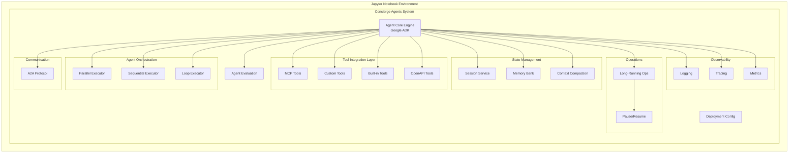

# Design Document: Concierge Agents System

## Overview

The Concierge Agents System is a comprehensive multi-agent orchestration platform built on Google's Agent Development Kit (ADK). The system will be implemented as an interactive Jupyter notebook that demonstrates all capabilities including agent orchestration patterns (parallel, sequential, loop), tool integration (MCP, custom, built-in, OpenAPI), long-running operations, session management, memory systems, context engineering, observability, evaluation, A2A protocol, and deployment.

### Technology Stack

- **Framework**: Google Agent Development Kit (ADK)
- **Implementation**: Jupyter Notebook (.ipynb)
- **Language**: Python 3.10+
- **LLM Integration**: Google ADK's LLM abstraction layer
- **Dependencies**: 
  - google-adk (core framework)
  - openapi-spec-validator (for OpenAPI tools)
  - requests (for HTTP operations)
  - asyncio (for async operations)
  - logging, prometheus-client (for observability)

## Architecture

### High-Level Architecture



### Component Architecture

The system follows a modular architecture with clear separation of concerns:

1. **Agent Core Engine**: Built on Google ADK, manages agent lifecycle and execution
2. **Orchestration Layer**: Handles parallel, sequential, and loop execution patterns
3. **Tool Integration Layer**: Unified interface for all tool types
4. **State Management Layer**: Sessions, memory, and context handling
5. **Operations Layer**: Long-running operations with pause/resume
6. **Observability Layer**: Logging, tracing, and metrics collection
7. **Communication Layer**: A2A protocol implementation
8. **Evaluation Layer**: Agent performance assessment
9. **Deployment Layer**: Configuration and deployment utilities

## Components and Interfaces

### 1. Agent Core Engine

**Purpose**: Foundation layer using Google ADK for agent creation and management

**Key Classes**:

```python
class ConciergeAgent:
    """Wrapper around Google ADK Agent with enhanced capabilities"""
    def __init__(self, name: str, llm_config: LLMConfig, tools: List[Tool])
    def execute(self, task: Task, session: Session) -> AgentResponse
    def add_tool(self, tool: Tool) -> None
    def get_state(self) -> AgentState
    def restore_state(self, state: AgentState) -> None
```

**Google ADK Integration**:
- Uses `google_adk.Agent` as the base agent class
- Leverages `google_adk.LLM` for LLM provider abstraction
- Utilizes `google_adk.Tool` interface for tool integration

### 2. Orchestration Components

#### Parallel Executor

```python
class ParallelExecutor:
    """Executes multiple agents concurrently"""
    def __init__(self, agents: List[ConciergeAgent])
    async def execute_all(self, tasks: List[Task]) -> List[AgentResponse]
    def aggregate_results(self, responses: List[AgentResponse]) -> AggregatedResult
```

**Design**: Uses Python's `asyncio` to run agents concurrently, collects all results, handles individual failures gracefully.

#### Sequential Executor

```python
class SequentialExecutor:
    """Executes agents in order, passing outputs as inputs"""
    def __init__(self, agents: List[ConciergeAgent])
    def execute_chain(self, initial_task: Task) -> AgentResponse
    def _pass_output_to_next(self, output: AgentResponse, next_agent: ConciergeAgent) -> Task
```

**Design**: Executes agents one by one, transforms output of agent N into input for agent N+1, stops on first failure.

#### Loop Executor

```python
class LoopExecutor:
    """Executes agent repeatedly based on condition"""
    def __init__(self, agent: ConciergeAgent, condition: Callable, max_iterations: int = 100)
    def execute_loop(self, initial_task: Task) -> List[AgentResponse]
    def evaluate_condition(self, response: AgentResponse) -> bool
```

**Design**: Evaluates condition before each iteration, maintains iteration state, enforces maximum iteration limit.

### 3. Tool Integration Layer

#### Base Tool Interface

```python
class Tool(ABC):
    """Base interface for all tools"""
    @abstractmethod
    def get_schema(self) -> Dict
    
    @abstractmethod
    def execute(self, params: Dict) -> ToolResult
    
    @abstractmethod
    def validate_params(self, params: Dict) -> bool
```

#### MCP Tool Integration

```python
class MCPTool(Tool):
    """Model Context Protocol tool wrapper"""
    def __init__(self, mcp_endpoint: str, tool_name: str)
    def get_schema(self) -> Dict
    def execute(self, params: Dict) -> ToolResult
    def _invoke_mcp(self, request: MCPRequest) -> MCPResponse
```

**Design**: Implements MCP protocol client, handles schema validation, manages MCP communication.

#### Custom Tool

```python
class CustomTool(Tool):
    """User-defined custom tool"""
    def __init__(self, name: str, description: str, schema: Dict, handler: Callable)
    def get_schema(self) -> Dict
    def execute(self, params: Dict) -> ToolResult
```

**Design**: Allows registration of arbitrary Python functions as tools with schema definition.

#### Built-in Tools

```python
class GoogleSearchTool(Tool):
    """Built-in Google Search integration"""
    def __init__(self, api_key: str)
    def execute(self, params: Dict) -> ToolResult

class CodeExecutionTool(Tool):
    """Built-in code execution in sandboxed environment"""
    def __init__(self, timeout: int = 30)
    def execute(self, params: Dict) -> ToolResult
    def _execute_in_sandbox(self, code: str) -> ExecutionResult
```

**Design**: Pre-built tools with authentication handling, rate limiting, and safety measures.

#### OpenAPI Tool

```python
class OpenAPITool(Tool):
    """Tool generated from OpenAPI specification"""
    def __init__(self, spec_url: str, operation_id: str)
    def get_schema(self) -> Dict
    def execute(self, params: Dict) -> ToolResult
    def _parse_openapi_spec(self, spec: Dict) -> ToolSchema
    def _make_http_request(self, endpoint: str, method: str, params: Dict) -> Response
```

**Design**: Parses OpenAPI spec, generates tool schema, handles HTTP requests with authentication.

### 4. State Management

#### Session Service

```python
class InMemorySessionService:
    """In-memory session management"""
    def __init__(self)
    def create_session(self) -> Session
    def get_session(self, session_id: str) -> Session
    def update_session(self, session_id: str, data: Dict) -> None
    def delete_session(self, session_id: str) -> None

class Session:
    """Session object containing conversation state"""
    session_id: str
    created_at: datetime
    conversation_history: List[Message]
    context: Dict
    metadata: Dict
```

**Design**: Stores sessions in memory dictionary, maintains conversation history, provides CRUD operations.

#### Memory Bank

```python
class MemoryBank:
    """Persistent long-term memory storage"""
    def __init__(self, storage_backend: str = "sqlite")
    def store(self, agent_id: str, key: str, value: Any, metadata: Dict) -> None
    def retrieve(self, agent_id: str, key: str) -> Any
    def search(self, agent_id: str, query: str, top_k: int = 5) -> List[MemoryEntry]
    def _compute_embedding(self, text: str) -> np.ndarray
```

**Design**: Uses SQLite for persistence, implements semantic search with embeddings, associates memories with agents.

#### Context Compaction

```python
class ContextCompactor:
    """Reduces context size while preserving information"""
    def __init__(self, strategy: str = "summarization")
    def compact(self, context: List[Message], target_size: int) -> List[Message]
    def _summarize_messages(self, messages: List[Message]) -> Message
    def _identify_critical_messages(self, messages: List[Message]) -> List[Message]
```

**Design**: Implements summarization strategy, preserves critical information, reduces token count by 30%+.

### 5. Long-Running Operations

```python
class LongRunningOperation:
    """Manages operations that can be paused and resumed"""
    def __init__(self, operation_id: str, agent: ConciergeAgent, task: Task)
    def start(self) -> None
    def pause(self) -> OperationState
    def resume(self, state: OperationState) -> None
    def get_status(self) -> OperationStatus
    
class OperationState:
    """Serializable operation state"""
    operation_id: str
    agent_state: AgentState
    task_state: TaskState
    execution_context: Dict
    timestamp: datetime
```

**Design**: Serializes complete operation state, persists to storage, restores state on resume, maintains execution context.

### 6. Observability

#### Logging

```python
class AgentLogger:
    """Structured logging for agent operations"""
    def __init__(self, log_level: str = "INFO")
    def log_agent_action(self, agent_id: str, action: str, details: Dict) -> None
    def log_tool_invocation(self, tool_name: str, params: Dict, result: ToolResult) -> None
    def log_error(self, error: Exception, context: Dict) -> None
```

#### Tracing

```python
class AgentTracer:
    """Distributed tracing for agent execution flows"""
    def __init__(self)
    def start_trace(self, operation: str) -> TraceContext
    def add_span(self, trace_id: str, span_name: str, metadata: Dict) -> None
    def end_trace(self, trace_id: str) -> Trace
```

#### Metrics

```python
class AgentMetrics:
    """Metrics collection for monitoring"""
    def __init__(self)
    def record_agent_response_time(self, agent_id: str, duration: float) -> None
    def record_tool_usage(self, tool_name: str) -> None
    def record_error(self, error_type: str) -> None
    def get_metrics_summary(self) -> Dict
```

**Design**: Uses Prometheus client for metrics, structured logging with JSON format, trace IDs for correlation.

### 7. Agent Evaluation

```python
class AgentEvaluator:
    """Framework for evaluating agent performance"""
    def __init__(self, metrics: List[EvaluationMetric])
    def evaluate(self, agent: ConciergeAgent, test_cases: List[TestCase]) -> EvaluationReport
    def add_metric(self, metric: EvaluationMetric) -> None
    def compare_agents(self, agents: List[ConciergeAgent], test_cases: List[TestCase]) -> ComparisonReport

class EvaluationMetric(ABC):
    """Base class for evaluation metrics"""
    @abstractmethod
    def calculate(self, response: AgentResponse, expected: Any) -> float

class AccuracyMetric(EvaluationMetric):
    """Measures response accuracy"""
    def calculate(self, response: AgentResponse, expected: Any) -> float

class LatencyMetric(EvaluationMetric):
    """Measures response latency"""
    def calculate(self, response: AgentResponse, expected: Any) -> float
```

**Design**: Pluggable metric system, stores evaluation history, generates comparison reports.

### 8. A2A Protocol

```python
class A2AProtocol:
    """Agent-to-Agent communication protocol"""
    def __init__(self)
    def register_agent(self, agent: ConciergeAgent) -> None
    def send_message(self, from_agent: str, to_agent: str, message: A2AMessage) -> None
    def receive_message(self, agent_id: str) -> Optional[A2AMessage]
    def send_sync(self, from_agent: str, to_agent: str, message: A2AMessage) -> A2AMessage
    
class A2AMessage:
    """Standardized inter-agent message"""
    message_id: str
    from_agent: str
    to_agent: str
    message_type: str
    payload: Dict
    timestamp: datetime
```

**Design**: Message queue for async communication, request-response for sync communication, message validation and routing.

### 9. Deployment

```python
class DeploymentConfig:
    """Configuration for agent deployment"""
    def __init__(self, agent: ConciergeAgent)
    def generate_dockerfile(self) -> str
    def generate_k8s_manifest(self) -> Dict
    def generate_health_check(self) -> Callable
    def export_config(self, format: str = "yaml") -> str

class HealthCheck:
    """Health check endpoint for deployed agents"""
    def __init__(self, agent: ConciergeAgent)
    def check_health(self) -> HealthStatus
    def check_readiness(self) -> ReadinessStatus
```

**Design**: Generates deployment artifacts, provides health check endpoints, supports containerization.

## Data Models

### Core Data Models

```python
@dataclass
class Task:
    """Represents a task for an agent"""
    task_id: str
    description: str
    input_data: Dict
    context: Optional[Dict] = None
    metadata: Optional[Dict] = None

@dataclass
class AgentResponse:
    """Response from agent execution"""
    task_id: str
    agent_id: str
    output: Any
    tool_calls: List[ToolCall]
    execution_time: float
    status: str  # success, error, partial
    error: Optional[Exception] = None

@dataclass
class ToolCall:
    """Record of a tool invocation"""
    tool_name: str
    params: Dict
    result: ToolResult
    execution_time: float

@dataclass
class ToolResult:
    """Result from tool execution"""
    success: bool
    data: Any
    error: Optional[str] = None
    metadata: Dict = field(default_factory=dict)

@dataclass
class LLMConfig:
    """Configuration for LLM"""
    provider: str  # e.g., "gemini", "openai"
    model: str
    temperature: float = 0.7
    max_tokens: int = 2048
    api_key: Optional[str] = None
```

### State Models

```python
@dataclass
class AgentState:
    """Serializable agent state"""
    agent_id: str
    conversation_history: List[Message]
    tool_states: Dict[str, Any]
    context: Dict
    timestamp: datetime

@dataclass
class Message:
    """Conversation message"""
    role: str  # user, assistant, system
    content: str
    timestamp: datetime
    metadata: Dict = field(default_factory=dict)
```

## Error Handling

### Error Hierarchy

```python
class ConciergeAgentError(Exception):
    """Base exception for all agent errors"""
    pass

class AgentExecutionError(ConciergeAgentError):
    """Error during agent execution"""
    pass

class ToolExecutionError(ConciergeAgentError):
    """Error during tool execution"""
    pass

class StateManagementError(ConciergeAgentError):
    """Error in state management"""
    pass

class ValidationError(ConciergeAgentError):
    """Error in input validation"""
    pass
```

### Error Handling Strategy

1. **Tool Errors**: Catch and return error in ToolResult, allow agent to handle gracefully
2. **Agent Errors**: Log error, return error response, don't crash orchestrator
3. **Orchestration Errors**: 
   - Parallel: Continue other agents, collect errors
   - Sequential: Stop chain, return error with partial results
   - Loop: Stop loop, return results up to failure
4. **State Errors**: Attempt recovery, fallback to clean state if needed
5. **Validation Errors**: Fail fast with clear error messages

### Retry Logic

```python
class RetryPolicy:
    """Configurable retry policy"""
    max_retries: int = 3
    backoff_factor: float = 2.0
    retryable_errors: List[Type[Exception]] = [ToolExecutionError]
    
    def should_retry(self, error: Exception, attempt: int) -> bool
    def get_delay(self, attempt: int) -> float
```

## Testing Strategy

### Unit Tests

- Test each component in isolation
- Mock external dependencies (LLM, tools, storage)
- Focus on business logic and error handling
- Target: 80%+ code coverage

**Key Test Areas**:
- Agent creation and configuration
- Tool execution and error handling
- Orchestration patterns (parallel, sequential, loop)
- State management (session, memory, context)
- A2A message routing
- Evaluation metrics calculation

### Integration Tests

- Test component interactions
- Use test doubles for expensive operations (LLM calls)
- Verify data flow between components
- Test error propagation

**Key Test Scenarios**:
- End-to-end agent execution with tools
- Multi-agent orchestration workflows
- Pause/resume long-running operations
- Memory storage and retrieval
- A2A communication between agents

### Notebook Validation

- Ensure all cells execute without errors
- Verify example outputs are correct
- Test with different LLM providers
- Validate deployment artifacts generation

## Notebook Structure

The Jupyter notebook will be organized into the following sections:

1. **Setup & Installation**
   - Install dependencies
   - Import libraries
   - Configure Google ADK

2. **Core Components**
   - Agent Core Engine implementation
   - Tool Integration Layer
   - State Management

3. **Orchestration Patterns**
   - Parallel execution examples
   - Sequential execution examples
   - Loop execution examples

4. **Tool Demonstrations**
   - MCP tool integration
   - Custom tool creation
   - Built-in tools usage
   - OpenAPI tool generation

5. **Advanced Features**
   - Long-running operations
   - Session management
   - Memory Bank usage
   - Context compaction

6. **Observability**
   - Logging examples
   - Tracing demonstrations
   - Metrics collection

7. **Evaluation & A2A**
   - Agent evaluation framework
   - A2A protocol examples

8. **Deployment**
   - Deployment configuration
   - Health checks
   - Export examples

9. **Complete Examples**
   - Full workflow demonstrations
   - Real-world use cases

Each section will include:
- Markdown documentation
- Code implementation
- Executable examples
- Output visualization

## Performance Considerations

1. **Async Operations**: Use asyncio for parallel agent execution to maximize throughput
2. **Connection Pooling**: Reuse HTTP connections for tool invocations
3. **Caching**: Cache tool schemas and OpenAPI specs
4. **Context Management**: Implement context compaction to reduce token usage
5. **Lazy Loading**: Load tools and components only when needed
6. **Batch Operations**: Support batch tool invocations where possible

## Security Considerations

1. **API Key Management**: Never hardcode API keys, use environment variables
2. **Code Execution Sandbox**: Isolate code execution tool in restricted environment
3. **Input Validation**: Validate all tool parameters before execution
4. **Rate Limiting**: Implement rate limits on tool usage
5. **Access Control**: Implement agent-level permissions for sensitive tools
6. **Audit Logging**: Log all agent actions and tool invocations

## Extensibility

The system is designed for extensibility:

1. **Custom Tools**: Easy registration of new tools via Tool interface
2. **Custom Metrics**: Pluggable evaluation metrics
3. **Custom Orchestration**: Extend orchestration patterns
4. **Storage Backends**: Swappable storage for sessions and memory
5. **LLM Providers**: Support for multiple LLM providers via Google ADK
6. **Observability Integration**: Export to external monitoring systems

## Dependencies

```python
# Core dependencies
google-adk>=1.0.0
jupyter>=1.0.0
notebook>=7.0.0

# Tool integration
requests>=2.31.0
openapi-spec-validator>=0.7.0

# Async support
asyncio>=3.4.3
aiohttp>=3.9.0

# Storage
sqlite3  # built-in

# Observability
prometheus-client>=0.19.0
structlog>=24.0.0

# Utilities
pydantic>=2.5.0
python-dotenv>=1.0.0
```

## Implementation Phases

The implementation will follow these phases:

**Phase 1: Core Foundation**
- Agent Core Engine with Google ADK
- Basic tool integration
- Simple execution patterns

**Phase 2: Orchestration**
- Parallel executor
- Sequential executor
- Loop executor

**Phase 3: Tools**
- MCP integration
- Custom tools
- Built-in tools
- OpenAPI tools

**Phase 4: State & Memory**
- Session service
- Memory Bank
- Context compaction

**Phase 5: Advanced Features**
- Long-running operations
- Observability
- Evaluation
- A2A protocol

**Phase 6: Deployment**
- Deployment configuration
- Health checks
- Documentation

Each phase will be implemented as a section in the Jupyter notebook with working examples.
